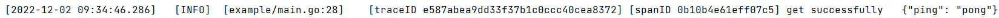

# Log

## 介绍

基于zap的封装，为了在日志中添加traceID和spanID两个信息每次记录日志时需传递gin.context进去，需配合trace包使用

## 使用

``` go
import (
	"github.com/Ltd5552/gin-observability/log"
	"github.com/Ltd5552/gin-observability/trace"
	"github.com/gin-gonic/gin"
)

func main() {

	r := gin.New()

	defer log.Sync()

	// 添加trace
	trace.Set(r, "test")

	r.GET("/get", func(c *gin.Context) {
        // 使用log，第一个参数是gin.Context
		log.Info(c, "test")
	})
}

```

### 结果

